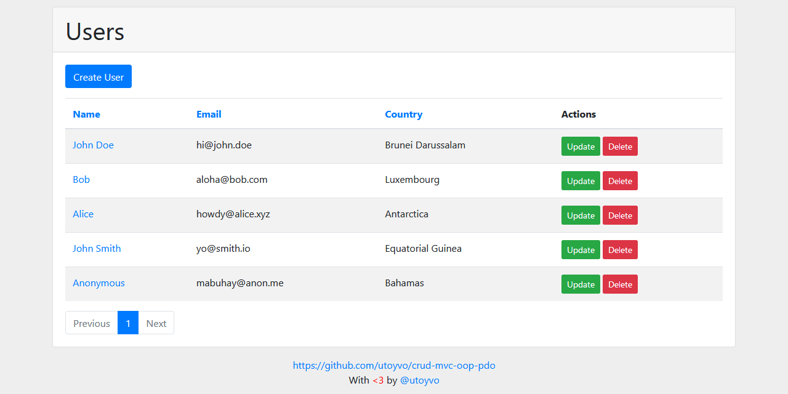

# CRUD MVC OOP PDO

A simple and intuitive CRUD system using the MVC pattern in OOP paradigm. To connect to the database using PDO.



## DATABASE

### Config

```php
return array(
	'db_driver'   => 'mysql',
	'db_server'   => 'localhost',
	'db_name'     => 'crud-mvc-oop-pdo',
	'db_username' => 'root',
	'db_password' => '',
);
```

### Table

#### Users

| Field           | Type         | Null | Key | Default           | Extra                       |
|:----------------|:-------------|:-----|:----|:------------------|:----------------------------|
| user_id         | INT(11)      | NO   | PRI | NULL              | AUTO_INCREMENT              |
| user_registered | DATETIME     | NO   |     | CURRENT_TIMESTAMP |                             |
| user_updated    | DATETIME     | NO   |     | CURRENT_TIMESTAMP | ON UPDATE CURRENT_TIMESTAMP |
| user_name       | VARCHAR(255) | NO   |     | NULL              |                             |
| user_email      | VARCHAR(255) | NO   |     | NULL              |                             |
| user_country    | INT(4)       | NO   |     | NULL              |                             |

#### Countries

| Field        | Type         | Null | Key | Default | Extra          |
|:-------------|:-------------|:-----|:----|:--------|:---------------|
| country_id   | INT(4)       | NO   | PRI | NULL    | AUTO_INCREMENT |
| country_code | VARCHAR(2)   | NO   |     | NULL    |                |
| country_name | VARCHAR(255) | NO   |     | NULL    |                |

## AUTHOR

- Oleksandr Klochko / [@utoyvo](https://github.com/utoyvo)

## LICENSE

Code released under the [MIT License](LICENSE).
